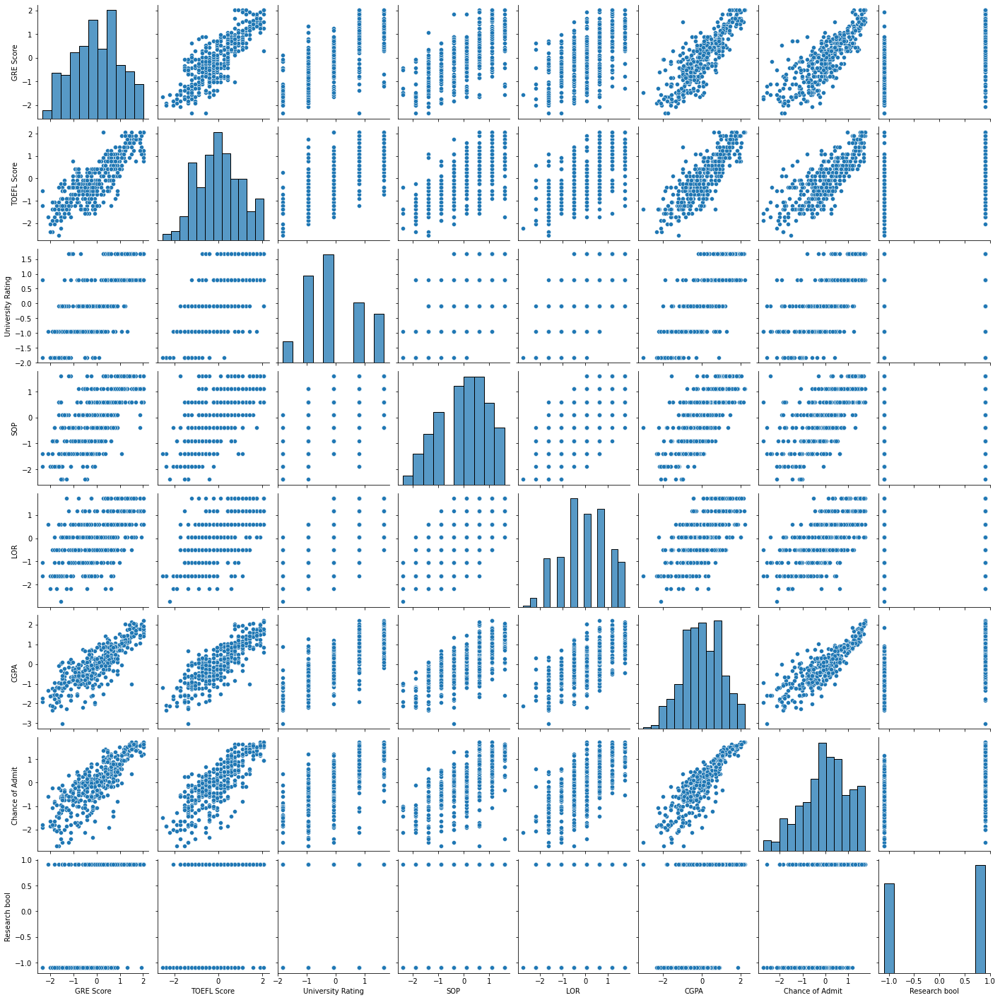
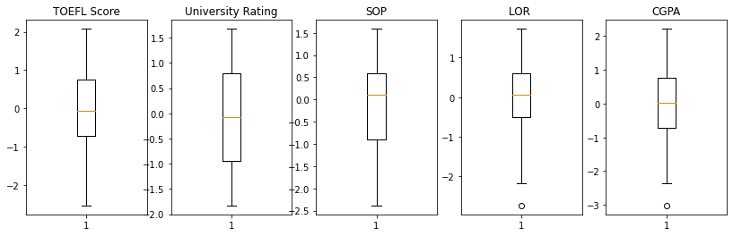
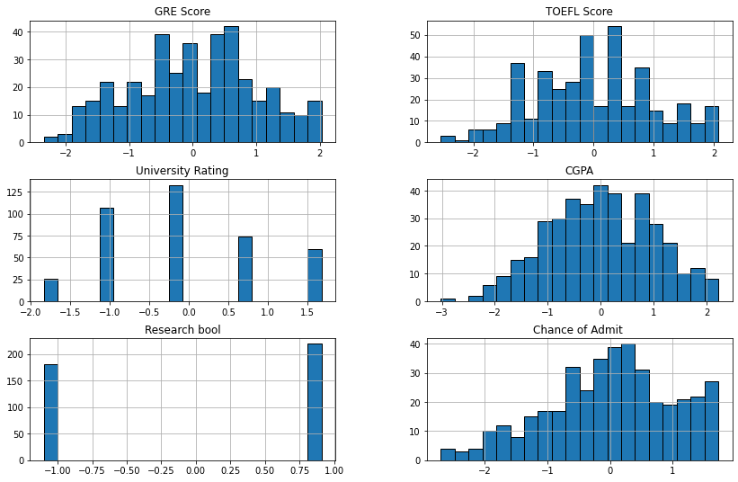

## Utkarsha Vidhale
# grad-admissions

 - [Data Scourse](https://www.kaggle.com/mohansacharya/graduate-admissions) 


This dataset is created for prediction of Graduate Admissions from an Indian perspective.


### Libraries used:


```python
import numpy as np
import pandas as pd
import statsmodels.api as sm
import seaborn as sns
import matplotlib.pyplot as plt
from heatmap import heatmap, corrplot
from sklearn.tree import DecisionTreeClassifier 
from sklearn import tree
from sklearn import linear_model
from sklearn.metrics import mean_squared_error, r2_score
from sklearn.model_selection import cross_val_score
from sklearn import svm
```


```python
import warnings
warnings.filterwarnings('ignore')
```

### Loading the dataset


```python
ap = pd.read_csv('ap.csv')
ap.head()
```


<div>
<style scoped>
    .dataframe tbody tr th:only-of-type {
        vertical-align: middle;
    }

    .dataframe tbody tr th {
        vertical-align: top;
    }

    .dataframe thead th {
        text-align: right;
    }
</style>
<table border="1" class="dataframe">
  <thead>
    <tr style="text-align: right;">
      <th></th>
      <th>Serial No.</th>
      <th>GRE Score</th>
      <th>TOEFL Score</th>
      <th>University Rating</th>
      <th>SOP</th>
      <th>LOR</th>
      <th>CGPA</th>
      <th>Research</th>
      <th>Chance of Admit</th>
    </tr>
  </thead>
  <tbody>
    <tr>
      <th>0</th>
      <td>1</td>
      <td>337</td>
      <td>118</td>
      <td>4</td>
      <td>4.5</td>
      <td>4.5</td>
      <td>9.65</td>
      <td>1</td>
      <td>0.92</td>
    </tr>
    <tr>
      <th>1</th>
      <td>2</td>
      <td>324</td>
      <td>107</td>
      <td>4</td>
      <td>4.0</td>
      <td>4.5</td>
      <td>8.87</td>
      <td>1</td>
      <td>0.76</td>
    </tr>
    <tr>
      <th>2</th>
      <td>3</td>
      <td>316</td>
      <td>104</td>
      <td>3</td>
      <td>3.0</td>
      <td>3.5</td>
      <td>8.00</td>
      <td>1</td>
      <td>0.72</td>
    </tr>
    <tr>
      <th>3</th>
      <td>4</td>
      <td>322</td>
      <td>110</td>
      <td>3</td>
      <td>3.5</td>
      <td>2.5</td>
      <td>8.67</td>
      <td>1</td>
      <td>0.80</td>
    </tr>
    <tr>
      <th>4</th>
      <td>5</td>
      <td>314</td>
      <td>103</td>
      <td>2</td>
      <td>2.0</td>
      <td>3.0</td>
      <td>8.21</td>
      <td>0</td>
      <td>0.65</td>
    </tr>
  </tbody>
</table>
</div>


```python
ap1 = pd.read_csv('apv1.csv')
ap1.head()
```


<div>
<style scoped>
    .dataframe tbody tr th:only-of-type {
        vertical-align: middle;
    }

    .dataframe tbody tr th {
        vertical-align: top;
    }

    .dataframe thead th {
        text-align: right;
    }
</style>
<table border="1" class="dataframe">
  <thead>
    <tr style="text-align: right;">
      <th></th>
      <th>Serial No.</th>
      <th>GRE Score</th>
      <th>TOEFL Score</th>
      <th>University Rating</th>
      <th>SOP</th>
      <th>LOR</th>
      <th>CGPA</th>
      <th>Research</th>
      <th>Chance of Admit</th>
    </tr>
  </thead>
  <tbody>
    <tr>
      <th>0</th>
      <td>1</td>
      <td>337</td>
      <td>118</td>
      <td>4</td>
      <td>4.5</td>
      <td>4.5</td>
      <td>9.65</td>
      <td>1</td>
      <td>0.92</td>
    </tr>
    <tr>
      <th>1</th>
      <td>2</td>
      <td>324</td>
      <td>107</td>
      <td>4</td>
      <td>4.0</td>
      <td>4.5</td>
      <td>8.87</td>
      <td>1</td>
      <td>0.76</td>
    </tr>
    <tr>
      <th>2</th>
      <td>3</td>
      <td>316</td>
      <td>104</td>
      <td>3</td>
      <td>3.0</td>
      <td>3.5</td>
      <td>8.00</td>
      <td>1</td>
      <td>0.72</td>
    </tr>
    <tr>
      <th>3</th>
      <td>4</td>
      <td>322</td>
      <td>110</td>
      <td>3</td>
      <td>3.5</td>
      <td>2.5</td>
      <td>8.67</td>
      <td>1</td>
      <td>0.80</td>
    </tr>
    <tr>
      <th>4</th>
      <td>5</td>
      <td>314</td>
      <td>103</td>
      <td>2</td>
      <td>2.0</td>
      <td>3.0</td>
      <td>8.21</td>
      <td>0</td>
      <td>0.65</td>
    </tr>
  </tbody>
</table>
</div>


#### Droping column 'Serial No.'


```python
ap=ap.drop(columns=['Serial No.'])
ap.info()
```

    <class 'pandas.core.frame.DataFrame'>
    RangeIndex: 400 entries, 0 to 399
    Data columns (total 8 columns):
     #   Column             Non-Null Count  Dtype  
    ---  ------             --------------  -----  
     0   GRE Score          400 non-null    int64  
     1   TOEFL Score        400 non-null    int64  
     2   University Rating  400 non-null    int64  
     3   SOP                400 non-null    float64
     4   LOR                400 non-null    float64
     5   CGPA               400 non-null    float64
     6   Research           400 non-null    int64  
     7   Chance of Admit    400 non-null    float64
    dtypes: float64(4), int64(4)
    memory usage: 25.1 KB
    

#### Converting 'Research' from int to bool


```python
ap['Research bool'] = np.where(ap['Research']==0, 0, 1).astype(bool)
ap.info()
```

    <class 'pandas.core.frame.DataFrame'>
    RangeIndex: 400 entries, 0 to 399
    Data columns (total 9 columns):
     #   Column             Non-Null Count  Dtype  
    ---  ------             --------------  -----  
     0   GRE Score          400 non-null    int64  
     1   TOEFL Score        400 non-null    int64  
     2   University Rating  400 non-null    int64  
     3   SOP                400 non-null    float64
     4   LOR                400 non-null    float64
     5   CGPA               400 non-null    float64
     6   Research           400 non-null    int64  
     7   Chance of Admit    400 non-null    float64
     8   Research bool      400 non-null    bool   
    dtypes: bool(1), float64(4), int64(4)
    memory usage: 25.5 KB
    


```python
ap=ap.drop(columns=['Research'])
ap.describe(include="all")
```


<div>
<style scoped>
    .dataframe tbody tr th:only-of-type {
        vertical-align: middle;
    }

    .dataframe tbody tr th {
        vertical-align: top;
    }

    .dataframe thead th {
        text-align: right;
    }
</style>
<table border="1" class="dataframe">
  <thead>
    <tr style="text-align: right;">
      <th></th>
      <th>GRE Score</th>
      <th>TOEFL Score</th>
      <th>University Rating</th>
      <th>SOP</th>
      <th>LOR</th>
      <th>CGPA</th>
      <th>Chance of Admit</th>
      <th>Research bool</th>
    </tr>
  </thead>
  <tbody>
    <tr>
      <th>count</th>
      <td>400.000000</td>
      <td>400.000000</td>
      <td>400.000000</td>
      <td>400.000000</td>
      <td>400.000000</td>
      <td>400.000000</td>
      <td>400.000000</td>
      <td>400</td>
    </tr>
    <tr>
      <th>unique</th>
      <td>NaN</td>
      <td>NaN</td>
      <td>NaN</td>
      <td>NaN</td>
      <td>NaN</td>
      <td>NaN</td>
      <td>NaN</td>
      <td>2</td>
    </tr>
    <tr>
      <th>top</th>
      <td>NaN</td>
      <td>NaN</td>
      <td>NaN</td>
      <td>NaN</td>
      <td>NaN</td>
      <td>NaN</td>
      <td>NaN</td>
      <td>True</td>
    </tr>
    <tr>
      <th>freq</th>
      <td>NaN</td>
      <td>NaN</td>
      <td>NaN</td>
      <td>NaN</td>
      <td>NaN</td>
      <td>NaN</td>
      <td>NaN</td>
      <td>219</td>
    </tr>
    <tr>
      <th>mean</th>
      <td>316.807500</td>
      <td>107.410000</td>
      <td>3.087500</td>
      <td>3.400000</td>
      <td>3.452500</td>
      <td>8.598925</td>
      <td>0.724350</td>
      <td>NaN</td>
    </tr>
    <tr>
      <th>std</th>
      <td>11.473646</td>
      <td>6.069514</td>
      <td>1.143728</td>
      <td>1.006869</td>
      <td>0.898478</td>
      <td>0.596317</td>
      <td>0.142609</td>
      <td>NaN</td>
    </tr>
    <tr>
      <th>min</th>
      <td>290.000000</td>
      <td>92.000000</td>
      <td>1.000000</td>
      <td>1.000000</td>
      <td>1.000000</td>
      <td>6.800000</td>
      <td>0.340000</td>
      <td>NaN</td>
    </tr>
    <tr>
      <th>25%</th>
      <td>308.000000</td>
      <td>103.000000</td>
      <td>2.000000</td>
      <td>2.500000</td>
      <td>3.000000</td>
      <td>8.170000</td>
      <td>0.640000</td>
      <td>NaN</td>
    </tr>
    <tr>
      <th>50%</th>
      <td>317.000000</td>
      <td>107.000000</td>
      <td>3.000000</td>
      <td>3.500000</td>
      <td>3.500000</td>
      <td>8.610000</td>
      <td>0.730000</td>
      <td>NaN</td>
    </tr>
    <tr>
      <th>75%</th>
      <td>325.000000</td>
      <td>112.000000</td>
      <td>4.000000</td>
      <td>4.000000</td>
      <td>4.000000</td>
      <td>9.062500</td>
      <td>0.830000</td>
      <td>NaN</td>
    </tr>
    <tr>
      <th>max</th>
      <td>340.000000</td>
      <td>120.000000</td>
      <td>5.000000</td>
      <td>5.000000</td>
      <td>5.000000</td>
      <td>9.920000</td>
      <td>0.970000</td>
      <td>NaN</td>
    </tr>
  </tbody>
</table>
</div>


```python
ap.shape
ap.columns
```


    Index(['GRE Score', 'TOEFL Score', 'University Rating', 'SOP', 'LOR ', 'CGPA',
           'Chance of Admit ', 'Research bool'],
          dtype='object')


The dataset contains several parameters which are considered important during the application for Masters Programs.
The parameters included are :

GRE Scores ( out of 340 ) 

TOEFL Scores ( out of 120 ) 

University Rating ( out of 5 ) 

Statement of Purpose and Letter of Recommendation Strength ( out of 5 ) 

Undergraduate GPA ( out of 10 ) 

Research Experience ( either 0 or 1 ) 

Chance of Admit ( ranging from 0.34 to 0.97 ) 

### Standardization 


```python
from sklearn import preprocessing
# Get column names first
names = ap.columns
# Create the Scaler object
scaler = preprocessing.StandardScaler()
# Fit your data on the scaler object
scaled_df = scaler.fit_transform(ap)
scaled_df = pd.DataFrame(scaled_df, columns=names)
scaled_df.describe(include="all")
```


<div>
<style scoped>
    .dataframe tbody tr th:only-of-type {
        vertical-align: middle;
    }

    .dataframe tbody tr th {
        vertical-align: top;
    }

    .dataframe thead th {
        text-align: right;
    }
</style>
<table border="1" class="dataframe">
  <thead>
    <tr style="text-align: right;">
      <th></th>
      <th>GRE Score</th>
      <th>TOEFL Score</th>
      <th>University Rating</th>
      <th>SOP</th>
      <th>LOR</th>
      <th>CGPA</th>
      <th>Chance of Admit</th>
      <th>Research bool</th>
    </tr>
  </thead>
  <tbody>
    <tr>
      <th>count</th>
      <td>4.000000e+02</td>
      <td>4.000000e+02</td>
      <td>4.000000e+02</td>
      <td>4.000000e+02</td>
      <td>4.000000e+02</td>
      <td>4.000000e+02</td>
      <td>4.000000e+02</td>
      <td>4.000000e+02</td>
    </tr>
    <tr>
      <th>mean</th>
      <td>-4.174439e-16</td>
      <td>5.595524e-16</td>
      <td>7.105427e-17</td>
      <td>7.993606e-17</td>
      <td>-1.332268e-16</td>
      <td>7.771561e-16</td>
      <td>-3.375078e-16</td>
      <td>-3.996803e-17</td>
    </tr>
    <tr>
      <th>std</th>
      <td>1.001252e+00</td>
      <td>1.001252e+00</td>
      <td>1.001252e+00</td>
      <td>1.001252e+00</td>
      <td>1.001252e+00</td>
      <td>1.001252e+00</td>
      <td>1.001252e+00</td>
      <td>1.001252e+00</td>
    </tr>
    <tr>
      <th>min</th>
      <td>-2.339367e+00</td>
      <td>-2.542098e+00</td>
      <td>-1.827457e+00</td>
      <td>-2.386613e+00</td>
      <td>-2.733036e+00</td>
      <td>-3.020504e+00</td>
      <td>-2.698500e+00</td>
      <td>-1.099975e+00</td>
    </tr>
    <tr>
      <th>25%</th>
      <td>-7.685900e-01</td>
      <td>-7.274920e-01</td>
      <td>-9.520286e-01</td>
      <td>-8.949798e-01</td>
      <td>-5.042604e-01</td>
      <td>-7.201909e-01</td>
      <td>-5.922168e-01</td>
      <td>-1.099975e+00</td>
    </tr>
    <tr>
      <th>50%</th>
      <td>1.679859e-02</td>
      <td>-6.763531e-02</td>
      <td>-7.660001e-02</td>
      <td>9.944220e-02</td>
      <td>5.293342e-02</td>
      <td>1.859559e-02</td>
      <td>3.966834e-02</td>
      <td>9.091117e-01</td>
    </tr>
    <tr>
      <th>75%</th>
      <td>7.149218e-01</td>
      <td>7.571856e-01</td>
      <td>7.988286e-01</td>
      <td>5.966532e-01</td>
      <td>6.101273e-01</td>
      <td>7.783704e-01</td>
      <td>7.417629e-01</td>
      <td>9.091117e-01</td>
    </tr>
    <tr>
      <th>max</th>
      <td>2.023903e+00</td>
      <td>2.076899e+00</td>
      <td>1.674257e+00</td>
      <td>1.591075e+00</td>
      <td>1.724515e+00</td>
      <td>2.218165e+00</td>
      <td>1.724695e+00</td>
      <td>9.091117e-01</td>
    </tr>
  </tbody>
</table>
</div>


### Relating variables


```python
sns.pairplot(scaled_df)
```


    <seaborn.axisgrid.PairGrid at 0x26baa940>


    

    


  From the above graph, it can be infered that `Chance of admit` is linearly related to most of the quantitative variables available. To get more detailed correlations, heatmat is plotted with respective co-efficients.


```python
correlation_matrix = scaled_df.corr()
figure = plt.figure(figsize = (14,10))
sns.heatmap(correlation_matrix, annot=True, cmap=plt.cm.Blues)
plt.show()
```


    

    


The correlation coefficient measures the statistical stength of the reationshipt between two variables.  
Based on the above derieved coefficients, the `Chance of Admit`*Our variable of interest* is highly correlated 
 (Correlation measurement > +- 0.6 )  to following variables: 
 - `GRE Score` (highly correlated, might check variation inflation factor post processing)
 
 - `Toefl Score` 
 
 - `University Ranking`
 
 - `SOP`
 
 - `LOR`
 
 - `CGPA` (highly correlated, might check variation inflation factor post processing)

##### Distribution of the variables


```python
plt.figure(1, figsize=(14,4)) 
for i in range(1,6):
    plt.subplot(1,5,i) 
    plt.boxplot(scaled_df[scaled_df.columns[i]]) 
    plt.title(scaled_df.columns[i])
plt.show()
scaled_df.describe() 
```


    

    


<div>
<style scoped>
    .dataframe tbody tr th:only-of-type {
        vertical-align: middle;
    }

    .dataframe tbody tr th {
        vertical-align: top;
    }

    .dataframe thead th {
        text-align: right;
    }
</style>
<table border="1" class="dataframe">
  <thead>
    <tr style="text-align: right;">
      <th></th>
      <th>GRE Score</th>
      <th>TOEFL Score</th>
      <th>University Rating</th>
      <th>SOP</th>
      <th>LOR</th>
      <th>CGPA</th>
      <th>Chance of Admit</th>
      <th>Research bool</th>
    </tr>
  </thead>
  <tbody>
    <tr>
      <th>count</th>
      <td>4.000000e+02</td>
      <td>4.000000e+02</td>
      <td>4.000000e+02</td>
      <td>4.000000e+02</td>
      <td>4.000000e+02</td>
      <td>4.000000e+02</td>
      <td>4.000000e+02</td>
      <td>4.000000e+02</td>
    </tr>
    <tr>
      <th>mean</th>
      <td>-4.174439e-16</td>
      <td>5.595524e-16</td>
      <td>7.105427e-17</td>
      <td>7.993606e-17</td>
      <td>-1.332268e-16</td>
      <td>7.771561e-16</td>
      <td>-3.375078e-16</td>
      <td>-3.996803e-17</td>
    </tr>
    <tr>
      <th>std</th>
      <td>1.001252e+00</td>
      <td>1.001252e+00</td>
      <td>1.001252e+00</td>
      <td>1.001252e+00</td>
      <td>1.001252e+00</td>
      <td>1.001252e+00</td>
      <td>1.001252e+00</td>
      <td>1.001252e+00</td>
    </tr>
    <tr>
      <th>min</th>
      <td>-2.339367e+00</td>
      <td>-2.542098e+00</td>
      <td>-1.827457e+00</td>
      <td>-2.386613e+00</td>
      <td>-2.733036e+00</td>
      <td>-3.020504e+00</td>
      <td>-2.698500e+00</td>
      <td>-1.099975e+00</td>
    </tr>
    <tr>
      <th>25%</th>
      <td>-7.685900e-01</td>
      <td>-7.274920e-01</td>
      <td>-9.520286e-01</td>
      <td>-8.949798e-01</td>
      <td>-5.042604e-01</td>
      <td>-7.201909e-01</td>
      <td>-5.922168e-01</td>
      <td>-1.099975e+00</td>
    </tr>
    <tr>
      <th>50%</th>
      <td>1.679859e-02</td>
      <td>-6.763531e-02</td>
      <td>-7.660001e-02</td>
      <td>9.944220e-02</td>
      <td>5.293342e-02</td>
      <td>1.859559e-02</td>
      <td>3.966834e-02</td>
      <td>9.091117e-01</td>
    </tr>
    <tr>
      <th>75%</th>
      <td>7.149218e-01</td>
      <td>7.571856e-01</td>
      <td>7.988286e-01</td>
      <td>5.966532e-01</td>
      <td>6.101273e-01</td>
      <td>7.783704e-01</td>
      <td>7.417629e-01</td>
      <td>9.091117e-01</td>
    </tr>
    <tr>
      <th>max</th>
      <td>2.023903e+00</td>
      <td>2.076899e+00</td>
      <td>1.674257e+00</td>
      <td>1.591075e+00</td>
      <td>1.724515e+00</td>
      <td>2.218165e+00</td>
      <td>1.724695e+00</td>
      <td>9.091117e-01</td>
    </tr>
  </tbody>
</table>
</div>


```python

scaled_df[['GRE Score','TOEFL Score','University Rating','CGPA','Research bool','Chance of Admit ']].hist(figsize=(14,9),bins=20,linewidth='1',edgecolor='k',grid=True)
#bins basicly means how many columns we want in this chart!

plt.show()

#We can see that most of the data normall distributed

#research is not normal distributed because its a binary data
```


    

    


### Splittig the data

Size of dataset is relatively very less and hence, n cross-fold vaidation is used.


```python
list(ap.columns)
```


    ['GRE Score',
     'TOEFL Score',
     'University Rating',
     'SOP',
     'LOR ',
     'CGPA',
     'Chance of Admit ',
     'Research bool']


```python
import statsmodels.api as sm
X=np.array(scaled_df.drop(['Chance of Admit '],1))
y=np.array(scaled_df['Chance of Admit '])
X= sm.add_constant(X)
```


```python
from sklearn.model_selection import train_test_split
X_train, X_test, y_train, y_test = train_test_split(X,y,test_size=0.3,random_state=1)
```


```python
X_test.shape, y_test.shape, X_train.shape, y_train.shape
```


    ((120, 8), (120,), (280, 8), (280,))


### Linear regression


```python
model = sm.OLS(y_train, X_train)
results = model.fit()
print(results.summary())
```

                                OLS Regression Results                            
    ==============================================================================
    Dep. Variable:                      y   R-squared:                       0.796
    Model:                            OLS   Adj. R-squared:                  0.790
    Method:                 Least Squares   F-statistic:                     151.4
    Date:                Sun, 27 Dec 2020   Prob (F-statistic):           5.92e-90
    Time:                        12:58:34   Log-Likelihood:                -167.00
    No. Observations:                 280   AIC:                             350.0
    Df Residuals:                     272   BIC:                             379.1
    Df Model:                           7                                         
    Covariance Type:            nonrobust                                         
    ==============================================================================
                     coef    std err          t      P>|t|      [0.025      0.975]
    ------------------------------------------------------------------------------
    const          0.0157      0.027      0.589      0.556      -0.037       0.068
    x1             0.1142      0.057      1.988      0.048       0.001       0.227
    x2             0.1140      0.055      2.067      0.040       0.005       0.223
    x3             0.0715      0.048      1.487      0.138      -0.023       0.166
    x4            -0.0009      0.049     -0.019      0.985      -0.097       0.095
    x5             0.1324      0.041      3.238      0.001       0.052       0.213
    x6             0.4511      0.061      7.444      0.000       0.332       0.570
    x7             0.1056      0.033      3.155      0.002       0.040       0.171
    ==============================================================================
    Omnibus:                       68.032   Durbin-Watson:                   2.044
    Prob(Omnibus):                  0.000   Jarque-Bera (JB):              144.011
    Skew:                          -1.207   Prob(JB):                     5.35e-32
    Kurtosis:                       5.553   Cond. No.                         5.98
    ==============================================================================
    
    Notes:
    [1] Standard Errors assume that the covariance matrix of the errors is correctly specified.
    


```python
model = sm.OLS(y_test, X_test)
results = model.fit()
print(results.summary())
```

                                OLS Regression Results                            
    ==============================================================================
    Dep. Variable:                      y   R-squared:                       0.833
    Model:                            OLS   Adj. R-squared:                  0.822
    Method:                 Least Squares   F-statistic:                     79.67
    Date:                Sun, 27 Dec 2020   Prob (F-statistic):           1.56e-40
    Time:                        12:58:35   Log-Likelihood:                -70.037
    No. Observations:                 120   AIC:                             156.1
    Df Residuals:                     112   BIC:                             178.4
    Df Model:                           7                                         
    Covariance Type:            nonrobust                                         
    ==============================================================================
                     coef    std err          t      P>|t|      [0.025      0.975]
    ------------------------------------------------------------------------------
    const         -0.0237      0.041     -0.571      0.569      -0.106       0.058
    x1             0.1991      0.091      2.183      0.031       0.018       0.380
    x2             0.1506      0.088      1.706      0.091      -0.024       0.325
    x3             0.0083      0.065      0.127      0.899      -0.121       0.138
    x4            -0.0798      0.067     -1.189      0.237      -0.213       0.053
    x5             0.1406      0.070      2.008      0.047       0.002       0.279
    x6             0.5794      0.098      5.930      0.000       0.386       0.773
    x7             0.0675      0.051      1.317      0.191      -0.034       0.169
    ==============================================================================
    Omnibus:                       28.979   Durbin-Watson:                   2.303
    Prob(Omnibus):                  0.000   Jarque-Bera (JB):               46.780
    Skew:                          -1.121   Prob(JB):                     6.95e-11
    Kurtosis:                       5.080   Cond. No.                         6.09
    ==============================================================================
    
    Notes:
    [1] Standard Errors assume that the covariance matrix of the errors is correctly specified.
    
