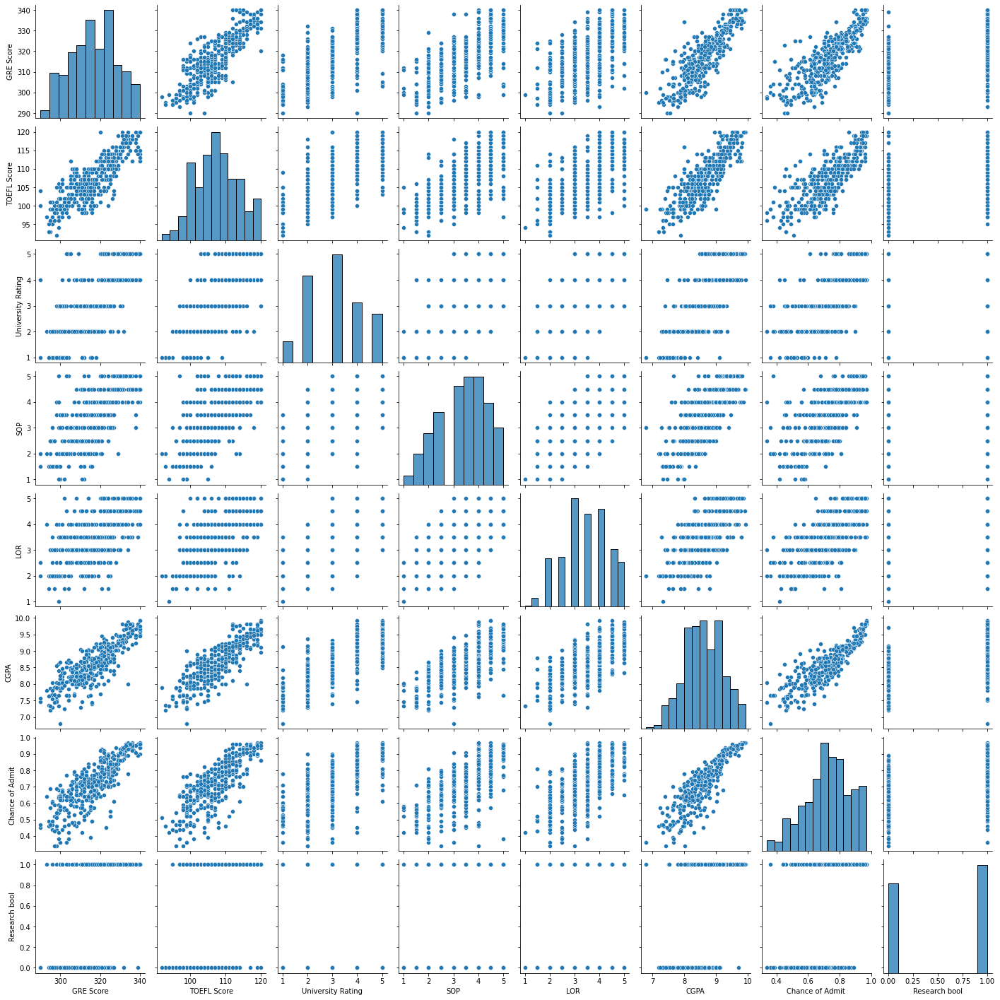
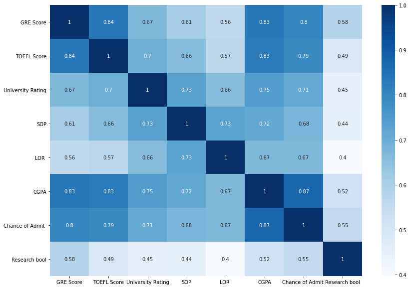
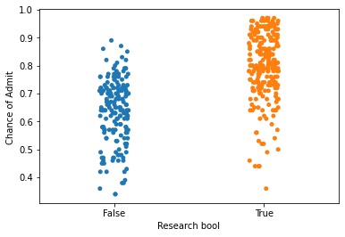

## Utkarsha Vidhale
# grad-admissions

 - [Data Scourse](https://www.kaggle.com/mohansacharya/graduate-admissions) 


This dataset is created for prediction of Graduate Admissions from an Indian perspective.


### Libraries used:


```python
import numpy as np
import pandas as pd
import statsmodels.api as sm
import seaborn as sns
import matplotlib.pyplot as plt
from heatmap import heatmap, corrplot
from sklearn.tree import DecisionTreeClassifier 
from sklearn import tree
from sklearn import linear_model
from sklearn.metrics import mean_squared_error, r2_score
from sklearn.model_selection import cross_val_score
from sklearn import svm
```


```python
import warnings
warnings.filterwarnings('ignore')
```

### Loading the dataset


```python
ap = pd.read_csv('ap.csv')
ap.head()
```


<div>
<style scoped>
    .dataframe tbody tr th:only-of-type {
        vertical-align: middle;
    }

    .dataframe tbody tr th {
        vertical-align: top;
    }

    .dataframe thead th {
        text-align: right;
    }
</style>
<table border="1" class="dataframe">
  <thead>
    <tr style="text-align: right;">
      <th></th>
      <th>Serial No.</th>
      <th>GRE Score</th>
      <th>TOEFL Score</th>
      <th>University Rating</th>
      <th>SOP</th>
      <th>LOR</th>
      <th>CGPA</th>
      <th>Research</th>
      <th>Chance of Admit</th>
    </tr>
  </thead>
  <tbody>
    <tr>
      <th>0</th>
      <td>1</td>
      <td>337</td>
      <td>118</td>
      <td>4</td>
      <td>4.5</td>
      <td>4.5</td>
      <td>9.65</td>
      <td>1</td>
      <td>0.92</td>
    </tr>
    <tr>
      <th>1</th>
      <td>2</td>
      <td>324</td>
      <td>107</td>
      <td>4</td>
      <td>4.0</td>
      <td>4.5</td>
      <td>8.87</td>
      <td>1</td>
      <td>0.76</td>
    </tr>
    <tr>
      <th>2</th>
      <td>3</td>
      <td>316</td>
      <td>104</td>
      <td>3</td>
      <td>3.0</td>
      <td>3.5</td>
      <td>8.00</td>
      <td>1</td>
      <td>0.72</td>
    </tr>
    <tr>
      <th>3</th>
      <td>4</td>
      <td>322</td>
      <td>110</td>
      <td>3</td>
      <td>3.5</td>
      <td>2.5</td>
      <td>8.67</td>
      <td>1</td>
      <td>0.80</td>
    </tr>
    <tr>
      <th>4</th>
      <td>5</td>
      <td>314</td>
      <td>103</td>
      <td>2</td>
      <td>2.0</td>
      <td>3.0</td>
      <td>8.21</td>
      <td>0</td>
      <td>0.65</td>
    </tr>
  </tbody>
</table>
</div>


```python
ap1 = pd.read_csv('apv1.csv')
ap1.head()
```


<div>
<style scoped>
    .dataframe tbody tr th:only-of-type {
        vertical-align: middle;
    }

    .dataframe tbody tr th {
        vertical-align: top;
    }

    .dataframe thead th {
        text-align: right;
    }
</style>
<table border="1" class="dataframe">
  <thead>
    <tr style="text-align: right;">
      <th></th>
      <th>Serial No.</th>
      <th>GRE Score</th>
      <th>TOEFL Score</th>
      <th>University Rating</th>
      <th>SOP</th>
      <th>LOR</th>
      <th>CGPA</th>
      <th>Research</th>
      <th>Chance of Admit</th>
    </tr>
  </thead>
  <tbody>
    <tr>
      <th>0</th>
      <td>1</td>
      <td>337</td>
      <td>118</td>
      <td>4</td>
      <td>4.5</td>
      <td>4.5</td>
      <td>9.65</td>
      <td>1</td>
      <td>0.92</td>
    </tr>
    <tr>
      <th>1</th>
      <td>2</td>
      <td>324</td>
      <td>107</td>
      <td>4</td>
      <td>4.0</td>
      <td>4.5</td>
      <td>8.87</td>
      <td>1</td>
      <td>0.76</td>
    </tr>
    <tr>
      <th>2</th>
      <td>3</td>
      <td>316</td>
      <td>104</td>
      <td>3</td>
      <td>3.0</td>
      <td>3.5</td>
      <td>8.00</td>
      <td>1</td>
      <td>0.72</td>
    </tr>
    <tr>
      <th>3</th>
      <td>4</td>
      <td>322</td>
      <td>110</td>
      <td>3</td>
      <td>3.5</td>
      <td>2.5</td>
      <td>8.67</td>
      <td>1</td>
      <td>0.80</td>
    </tr>
    <tr>
      <th>4</th>
      <td>5</td>
      <td>314</td>
      <td>103</td>
      <td>2</td>
      <td>2.0</td>
      <td>3.0</td>
      <td>8.21</td>
      <td>0</td>
      <td>0.65</td>
    </tr>
  </tbody>
</table>
</div>


#### Droping column 'Serial No.'


```python
ap=ap.drop(columns=['Serial No.'])
ap.info()
```

    <class 'pandas.core.frame.DataFrame'>
    RangeIndex: 400 entries, 0 to 399
    Data columns (total 8 columns):
     #   Column             Non-Null Count  Dtype  
    ---  ------             --------------  -----  
     0   GRE Score          400 non-null    int64  
     1   TOEFL Score        400 non-null    int64  
     2   University Rating  400 non-null    int64  
     3   SOP                400 non-null    float64
     4   LOR                400 non-null    float64
     5   CGPA               400 non-null    float64
     6   Research           400 non-null    int64  
     7   Chance of Admit    400 non-null    float64
    dtypes: float64(4), int64(4)
    memory usage: 25.1 KB
    

#### Converting 'Research' from int to bool


```python
ap['Research bool'] = np.where(ap['Research']==0, 0, 1).astype(bool)
ap.info()
```

    <class 'pandas.core.frame.DataFrame'>
    RangeIndex: 400 entries, 0 to 399
    Data columns (total 9 columns):
     #   Column             Non-Null Count  Dtype  
    ---  ------             --------------  -----  
     0   GRE Score          400 non-null    int64  
     1   TOEFL Score        400 non-null    int64  
     2   University Rating  400 non-null    int64  
     3   SOP                400 non-null    float64
     4   LOR                400 non-null    float64
     5   CGPA               400 non-null    float64
     6   Research           400 non-null    int64  
     7   Chance of Admit    400 non-null    float64
     8   Research bool      400 non-null    bool   
    dtypes: bool(1), float64(4), int64(4)
    memory usage: 25.5 KB
    


```python
ap=ap.drop(columns=['Research'])
ap.describe(include="all")
```


<div>
<style scoped>
    .dataframe tbody tr th:only-of-type {
        vertical-align: middle;
    }

    .dataframe tbody tr th {
        vertical-align: top;
    }

    .dataframe thead th {
        text-align: right;
    }
</style>
<table border="1" class="dataframe">
  <thead>
    <tr style="text-align: right;">
      <th></th>
      <th>GRE Score</th>
      <th>TOEFL Score</th>
      <th>University Rating</th>
      <th>SOP</th>
      <th>LOR</th>
      <th>CGPA</th>
      <th>Chance of Admit</th>
      <th>Research bool</th>
    </tr>
  </thead>
  <tbody>
    <tr>
      <th>count</th>
      <td>400.000000</td>
      <td>400.000000</td>
      <td>400.000000</td>
      <td>400.000000</td>
      <td>400.000000</td>
      <td>400.000000</td>
      <td>400.000000</td>
      <td>400</td>
    </tr>
    <tr>
      <th>unique</th>
      <td>NaN</td>
      <td>NaN</td>
      <td>NaN</td>
      <td>NaN</td>
      <td>NaN</td>
      <td>NaN</td>
      <td>NaN</td>
      <td>2</td>
    </tr>
    <tr>
      <th>top</th>
      <td>NaN</td>
      <td>NaN</td>
      <td>NaN</td>
      <td>NaN</td>
      <td>NaN</td>
      <td>NaN</td>
      <td>NaN</td>
      <td>True</td>
    </tr>
    <tr>
      <th>freq</th>
      <td>NaN</td>
      <td>NaN</td>
      <td>NaN</td>
      <td>NaN</td>
      <td>NaN</td>
      <td>NaN</td>
      <td>NaN</td>
      <td>219</td>
    </tr>
    <tr>
      <th>mean</th>
      <td>316.807500</td>
      <td>107.410000</td>
      <td>3.087500</td>
      <td>3.400000</td>
      <td>3.452500</td>
      <td>8.598925</td>
      <td>0.724350</td>
      <td>NaN</td>
    </tr>
    <tr>
      <th>std</th>
      <td>11.473646</td>
      <td>6.069514</td>
      <td>1.143728</td>
      <td>1.006869</td>
      <td>0.898478</td>
      <td>0.596317</td>
      <td>0.142609</td>
      <td>NaN</td>
    </tr>
    <tr>
      <th>min</th>
      <td>290.000000</td>
      <td>92.000000</td>
      <td>1.000000</td>
      <td>1.000000</td>
      <td>1.000000</td>
      <td>6.800000</td>
      <td>0.340000</td>
      <td>NaN</td>
    </tr>
    <tr>
      <th>25%</th>
      <td>308.000000</td>
      <td>103.000000</td>
      <td>2.000000</td>
      <td>2.500000</td>
      <td>3.000000</td>
      <td>8.170000</td>
      <td>0.640000</td>
      <td>NaN</td>
    </tr>
    <tr>
      <th>50%</th>
      <td>317.000000</td>
      <td>107.000000</td>
      <td>3.000000</td>
      <td>3.500000</td>
      <td>3.500000</td>
      <td>8.610000</td>
      <td>0.730000</td>
      <td>NaN</td>
    </tr>
    <tr>
      <th>75%</th>
      <td>325.000000</td>
      <td>112.000000</td>
      <td>4.000000</td>
      <td>4.000000</td>
      <td>4.000000</td>
      <td>9.062500</td>
      <td>0.830000</td>
      <td>NaN</td>
    </tr>
    <tr>
      <th>max</th>
      <td>340.000000</td>
      <td>120.000000</td>
      <td>5.000000</td>
      <td>5.000000</td>
      <td>5.000000</td>
      <td>9.920000</td>
      <td>0.970000</td>
      <td>NaN</td>
    </tr>
  </tbody>
</table>
</div>


```python
ap.shape
ap.columns
```


    Index(['GRE Score', 'TOEFL Score', 'University Rating', 'SOP', 'LOR ', 'CGPA',
           'Chance of Admit ', 'Research bool'],
          dtype='object')


The dataset contains several parameters which are considered important during the application for Masters Programs.
The parameters included are :

GRE Scores ( out of 340 ) 

TOEFL Scores ( out of 120 ) 

University Rating ( out of 5 ) 

Statement of Purpose and Letter of Recommendation Strength ( out of 5 ) 

Undergraduate GPA ( out of 10 ) 

Research Experience ( either 0 or 1 ) 

Chance of Admit ( ranging from 0.34 to 0.97 ) 

### Relating variables


```python
sns.pairplot(ap)
```


    <seaborn.axisgrid.PairGrid at 0x26bdd370>


    

    


    From the above graph, it can be infered that `Chance of admit` is linearly related to most of the quantitative variables available. To get more detailed correlations, heatmat is plotted with respective co-efficients.


```python
correlation_matrix = ap.corr()
figure = plt.figure(figsize = (14,10))
sns.heatmap(correlation_matrix, annot=True, cmap=plt.cm.Blues)
plt.show()
```


    

    


The correlation coefficient measures the statistical stength of the reationshipt between two variables.  
Based on the above derieved coefficients, the `Chance of Admit`*Our variable of interest* is highly correlated 
 (Correlation measurement > +- 0.6 )  to following variables: 
 - `GRE Score` 
 
 - `Toefl Score` 
 
 - `University Ranking`
 
 - `SOP`
 
 - `LOR`
 
 - `CGPA`

##### Analyzing `Chance of Admit` and `Research bool`


```python
sns.stripplot(x=ap['Research bool'],y=ap['Chance of Admit '])
```


    <AxesSubplot:xlabel='Research bool', ylabel='Chance of Admit '>


    

    


### Splittig the data

Size of dataset is relatively very less and hence, n cross-fold vaidation is used.


```python
x = ap.drop('Chance of Admit ', 1)
y = ap['Chance of Admit ']
x.shape, y.shape
# N-fold cross validation
#acc=cross_val_score(clf, x, y, cv=5, scoring='accuracy').mean()
```


    ((400, 7), (400,))


```python
#N-fold cross validation
clf = svm.SVC(kernel='linear', C=1, random_state=42)
acc=cross_val_score(clf, x, y, cv=4, scoring='accuracy')

```


```python
import numpy as np
from sklearn.model_selection import KFold
X = ap.drop('Chance of Admit ', 1)
y = ap['Chance of Admit ']
kf = KFold(n_splits=2)
kf.get_n_splits(X)
```


```python
list(ap.columns)
```


    ['GRE Score',
     'TOEFL Score',
     'University Rating',
     'SOP',
     'LOR ',
     'CGPA',
     'Chance of Admit ',
     'Research bool']


```python
from sklearn.model_selection import train_test_split
rs=42
predict="Chance of Admit"
X=np.array(ap.drop(['Chance of Admit '],1))
y=np.array(ap['Chance of Admit '])
X_train, X_test,y_train, y_test=train_test_split(X,y,test_size=0.2,random_state=rs)
#20% training and 80% testing
```


```python
# Create linear regression object
regr = linear_model.LinearRegression()

# Train the model using the training sets
regr.fit(X_train, y_train)
```


    LinearRegression()


```python
# Make predictions using the testing set
chance_y_pred = regr.predict(X_test)
```


```python
# The coefficients
print('Coefficients: \n', regr.coef_)
# The mean squared error
print('Mean squared error: %.2f'
      % mean_squared_error(y_test, chance_y_pred))
# The coefficient of determination: 1 is perfect prediction
print('Coefficient of determination: %.2f'
      % r2_score(y_test, chance_y_pred))

# Plot outputs
plt.scatter(X_test, y_test,  color='black')
plt.plot(X_test, chance_y_pred, color='blue', linewidth=3)

plt.xticks(())
plt.yticks(())

plt.show()
```


```python

```
