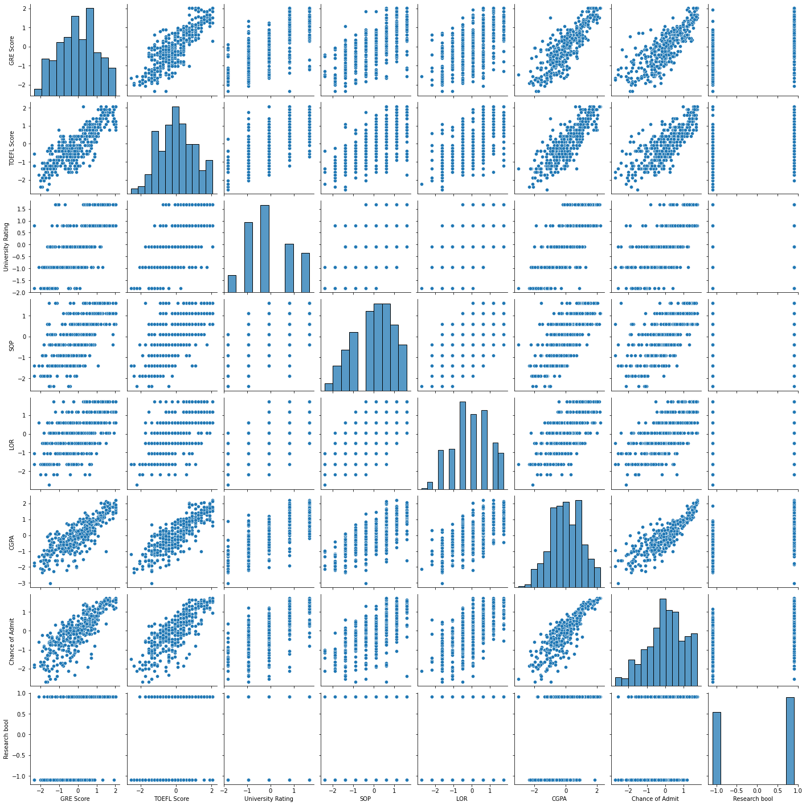
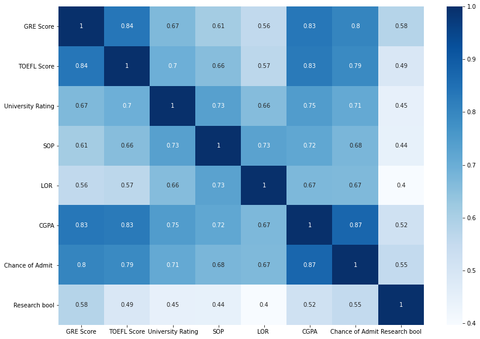
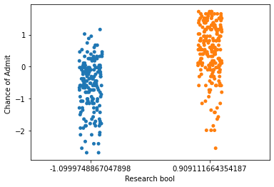

## Utkarsha Vidhale
# grad-admissions

 - [Data Scourse](https://www.kaggle.com/mohansacharya/graduate-admissions) 


This dataset is created for prediction of Graduate Admissions from an Indian perspective.


### Libraries used:


```python
import numpy as np
import pandas as pd
import statsmodels.api as sm
import seaborn as sns
import matplotlib.pyplot as plt
from heatmap import heatmap, corrplot
from sklearn.tree import DecisionTreeClassifier 
from sklearn import tree
from sklearn import linear_model
from sklearn.metrics import mean_squared_error, r2_score
from sklearn.model_selection import cross_val_score
from sklearn import svm
```


```python
import warnings
warnings.filterwarnings('ignore')
```

### Loading the dataset


```python
ap = pd.read_csv('ap.csv')
ap.head()
```


<div>
<style scoped>
    .dataframe tbody tr th:only-of-type {
        vertical-align: middle;
    }

    .dataframe tbody tr th {
        vertical-align: top;
    }

    .dataframe thead th {
        text-align: right;
    }
</style>
<table border="1" class="dataframe">
  <thead>
    <tr style="text-align: right;">
      <th></th>
      <th>Serial No.</th>
      <th>GRE Score</th>
      <th>TOEFL Score</th>
      <th>University Rating</th>
      <th>SOP</th>
      <th>LOR</th>
      <th>CGPA</th>
      <th>Research</th>
      <th>Chance of Admit</th>
    </tr>
  </thead>
  <tbody>
    <tr>
      <th>0</th>
      <td>1</td>
      <td>337</td>
      <td>118</td>
      <td>4</td>
      <td>4.5</td>
      <td>4.5</td>
      <td>9.65</td>
      <td>1</td>
      <td>0.92</td>
    </tr>
    <tr>
      <th>1</th>
      <td>2</td>
      <td>324</td>
      <td>107</td>
      <td>4</td>
      <td>4.0</td>
      <td>4.5</td>
      <td>8.87</td>
      <td>1</td>
      <td>0.76</td>
    </tr>
    <tr>
      <th>2</th>
      <td>3</td>
      <td>316</td>
      <td>104</td>
      <td>3</td>
      <td>3.0</td>
      <td>3.5</td>
      <td>8.00</td>
      <td>1</td>
      <td>0.72</td>
    </tr>
    <tr>
      <th>3</th>
      <td>4</td>
      <td>322</td>
      <td>110</td>
      <td>3</td>
      <td>3.5</td>
      <td>2.5</td>
      <td>8.67</td>
      <td>1</td>
      <td>0.80</td>
    </tr>
    <tr>
      <th>4</th>
      <td>5</td>
      <td>314</td>
      <td>103</td>
      <td>2</td>
      <td>2.0</td>
      <td>3.0</td>
      <td>8.21</td>
      <td>0</td>
      <td>0.65</td>
    </tr>
  </tbody>
</table>
</div>


```python
ap1 = pd.read_csv('apv1.csv')
ap1.head()
```


<div>
<style scoped>
    .dataframe tbody tr th:only-of-type {
        vertical-align: middle;
    }

    .dataframe tbody tr th {
        vertical-align: top;
    }

    .dataframe thead th {
        text-align: right;
    }
</style>
<table border="1" class="dataframe">
  <thead>
    <tr style="text-align: right;">
      <th></th>
      <th>Serial No.</th>
      <th>GRE Score</th>
      <th>TOEFL Score</th>
      <th>University Rating</th>
      <th>SOP</th>
      <th>LOR</th>
      <th>CGPA</th>
      <th>Research</th>
      <th>Chance of Admit</th>
    </tr>
  </thead>
  <tbody>
    <tr>
      <th>0</th>
      <td>1</td>
      <td>337</td>
      <td>118</td>
      <td>4</td>
      <td>4.5</td>
      <td>4.5</td>
      <td>9.65</td>
      <td>1</td>
      <td>0.92</td>
    </tr>
    <tr>
      <th>1</th>
      <td>2</td>
      <td>324</td>
      <td>107</td>
      <td>4</td>
      <td>4.0</td>
      <td>4.5</td>
      <td>8.87</td>
      <td>1</td>
      <td>0.76</td>
    </tr>
    <tr>
      <th>2</th>
      <td>3</td>
      <td>316</td>
      <td>104</td>
      <td>3</td>
      <td>3.0</td>
      <td>3.5</td>
      <td>8.00</td>
      <td>1</td>
      <td>0.72</td>
    </tr>
    <tr>
      <th>3</th>
      <td>4</td>
      <td>322</td>
      <td>110</td>
      <td>3</td>
      <td>3.5</td>
      <td>2.5</td>
      <td>8.67</td>
      <td>1</td>
      <td>0.80</td>
    </tr>
    <tr>
      <th>4</th>
      <td>5</td>
      <td>314</td>
      <td>103</td>
      <td>2</td>
      <td>2.0</td>
      <td>3.0</td>
      <td>8.21</td>
      <td>0</td>
      <td>0.65</td>
    </tr>
  </tbody>
</table>
</div>


#### Droping column 'Serial No.'


```python
ap=ap.drop(columns=['Serial No.'])
ap.info()
```

    <class 'pandas.core.frame.DataFrame'>
    RangeIndex: 400 entries, 0 to 399
    Data columns (total 8 columns):
     #   Column             Non-Null Count  Dtype  
    ---  ------             --------------  -----  
     0   GRE Score          400 non-null    int64  
     1   TOEFL Score        400 non-null    int64  
     2   University Rating  400 non-null    int64  
     3   SOP                400 non-null    float64
     4   LOR                400 non-null    float64
     5   CGPA               400 non-null    float64
     6   Research           400 non-null    int64  
     7   Chance of Admit    400 non-null    float64
    dtypes: float64(4), int64(4)
    memory usage: 25.1 KB
    

#### Converting 'Research' from int to bool


```python
ap['Research bool'] = np.where(ap['Research']==0, 0, 1).astype(bool)
ap.info()
```

    <class 'pandas.core.frame.DataFrame'>
    RangeIndex: 400 entries, 0 to 399
    Data columns (total 9 columns):
     #   Column             Non-Null Count  Dtype  
    ---  ------             --------------  -----  
     0   GRE Score          400 non-null    int64  
     1   TOEFL Score        400 non-null    int64  
     2   University Rating  400 non-null    int64  
     3   SOP                400 non-null    float64
     4   LOR                400 non-null    float64
     5   CGPA               400 non-null    float64
     6   Research           400 non-null    int64  
     7   Chance of Admit    400 non-null    float64
     8   Research bool      400 non-null    bool   
    dtypes: bool(1), float64(4), int64(4)
    memory usage: 25.5 KB
    


```python
ap=ap.drop(columns=['Research'])
ap.describe(include="all")
```


<div>
<style scoped>
    .dataframe tbody tr th:only-of-type {
        vertical-align: middle;
    }

    .dataframe tbody tr th {
        vertical-align: top;
    }

    .dataframe thead th {
        text-align: right;
    }
</style>
<table border="1" class="dataframe">
  <thead>
    <tr style="text-align: right;">
      <th></th>
      <th>GRE Score</th>
      <th>TOEFL Score</th>
      <th>University Rating</th>
      <th>SOP</th>
      <th>LOR</th>
      <th>CGPA</th>
      <th>Chance of Admit</th>
      <th>Research bool</th>
    </tr>
  </thead>
  <tbody>
    <tr>
      <th>count</th>
      <td>400.000000</td>
      <td>400.000000</td>
      <td>400.000000</td>
      <td>400.000000</td>
      <td>400.000000</td>
      <td>400.000000</td>
      <td>400.000000</td>
      <td>400</td>
    </tr>
    <tr>
      <th>unique</th>
      <td>NaN</td>
      <td>NaN</td>
      <td>NaN</td>
      <td>NaN</td>
      <td>NaN</td>
      <td>NaN</td>
      <td>NaN</td>
      <td>2</td>
    </tr>
    <tr>
      <th>top</th>
      <td>NaN</td>
      <td>NaN</td>
      <td>NaN</td>
      <td>NaN</td>
      <td>NaN</td>
      <td>NaN</td>
      <td>NaN</td>
      <td>True</td>
    </tr>
    <tr>
      <th>freq</th>
      <td>NaN</td>
      <td>NaN</td>
      <td>NaN</td>
      <td>NaN</td>
      <td>NaN</td>
      <td>NaN</td>
      <td>NaN</td>
      <td>219</td>
    </tr>
    <tr>
      <th>mean</th>
      <td>316.807500</td>
      <td>107.410000</td>
      <td>3.087500</td>
      <td>3.400000</td>
      <td>3.452500</td>
      <td>8.598925</td>
      <td>0.724350</td>
      <td>NaN</td>
    </tr>
    <tr>
      <th>std</th>
      <td>11.473646</td>
      <td>6.069514</td>
      <td>1.143728</td>
      <td>1.006869</td>
      <td>0.898478</td>
      <td>0.596317</td>
      <td>0.142609</td>
      <td>NaN</td>
    </tr>
    <tr>
      <th>min</th>
      <td>290.000000</td>
      <td>92.000000</td>
      <td>1.000000</td>
      <td>1.000000</td>
      <td>1.000000</td>
      <td>6.800000</td>
      <td>0.340000</td>
      <td>NaN</td>
    </tr>
    <tr>
      <th>25%</th>
      <td>308.000000</td>
      <td>103.000000</td>
      <td>2.000000</td>
      <td>2.500000</td>
      <td>3.000000</td>
      <td>8.170000</td>
      <td>0.640000</td>
      <td>NaN</td>
    </tr>
    <tr>
      <th>50%</th>
      <td>317.000000</td>
      <td>107.000000</td>
      <td>3.000000</td>
      <td>3.500000</td>
      <td>3.500000</td>
      <td>8.610000</td>
      <td>0.730000</td>
      <td>NaN</td>
    </tr>
    <tr>
      <th>75%</th>
      <td>325.000000</td>
      <td>112.000000</td>
      <td>4.000000</td>
      <td>4.000000</td>
      <td>4.000000</td>
      <td>9.062500</td>
      <td>0.830000</td>
      <td>NaN</td>
    </tr>
    <tr>
      <th>max</th>
      <td>340.000000</td>
      <td>120.000000</td>
      <td>5.000000</td>
      <td>5.000000</td>
      <td>5.000000</td>
      <td>9.920000</td>
      <td>0.970000</td>
      <td>NaN</td>
    </tr>
  </tbody>
</table>
</div>


```python
ap.shape
ap.columns
```


    Index(['GRE Score', 'TOEFL Score', 'University Rating', 'SOP', 'LOR ', 'CGPA',
           'Chance of Admit ', 'Research bool'],
          dtype='object')


The dataset contains several parameters which are considered important during the application for Masters Programs.
The parameters included are :

GRE Scores ( out of 340 ) 

TOEFL Scores ( out of 120 ) 

University Rating ( out of 5 ) 

Statement of Purpose and Letter of Recommendation Strength ( out of 5 ) 

Undergraduate GPA ( out of 10 ) 

Research Experience ( either 0 or 1 ) 

Chance of Admit ( ranging from 0.34 to 0.97 ) 

### Standardization 


```python
from sklearn import preprocessing
# Get column names first
names = ap.columns
# Create the Scaler object
scaler = preprocessing.StandardScaler()
# Fit your data on the scaler object
scaled_df = scaler.fit_transform(ap)
scaled_df = pd.DataFrame(scaled_df, columns=names)
scaled_df.describe(include="all")
```


<div>
<style scoped>
    .dataframe tbody tr th:only-of-type {
        vertical-align: middle;
    }

    .dataframe tbody tr th {
        vertical-align: top;
    }

    .dataframe thead th {
        text-align: right;
    }
</style>
<table border="1" class="dataframe">
  <thead>
    <tr style="text-align: right;">
      <th></th>
      <th>GRE Score</th>
      <th>TOEFL Score</th>
      <th>University Rating</th>
      <th>SOP</th>
      <th>LOR</th>
      <th>CGPA</th>
      <th>Chance of Admit</th>
      <th>Research bool</th>
    </tr>
  </thead>
  <tbody>
    <tr>
      <th>count</th>
      <td>4.000000e+02</td>
      <td>4.000000e+02</td>
      <td>4.000000e+02</td>
      <td>4.000000e+02</td>
      <td>4.000000e+02</td>
      <td>4.000000e+02</td>
      <td>4.000000e+02</td>
      <td>4.000000e+02</td>
    </tr>
    <tr>
      <th>mean</th>
      <td>-4.174439e-16</td>
      <td>5.595524e-16</td>
      <td>7.105427e-17</td>
      <td>7.993606e-17</td>
      <td>-1.332268e-16</td>
      <td>7.771561e-16</td>
      <td>-3.375078e-16</td>
      <td>-3.996803e-17</td>
    </tr>
    <tr>
      <th>std</th>
      <td>1.001252e+00</td>
      <td>1.001252e+00</td>
      <td>1.001252e+00</td>
      <td>1.001252e+00</td>
      <td>1.001252e+00</td>
      <td>1.001252e+00</td>
      <td>1.001252e+00</td>
      <td>1.001252e+00</td>
    </tr>
    <tr>
      <th>min</th>
      <td>-2.339367e+00</td>
      <td>-2.542098e+00</td>
      <td>-1.827457e+00</td>
      <td>-2.386613e+00</td>
      <td>-2.733036e+00</td>
      <td>-3.020504e+00</td>
      <td>-2.698500e+00</td>
      <td>-1.099975e+00</td>
    </tr>
    <tr>
      <th>25%</th>
      <td>-7.685900e-01</td>
      <td>-7.274920e-01</td>
      <td>-9.520286e-01</td>
      <td>-8.949798e-01</td>
      <td>-5.042604e-01</td>
      <td>-7.201909e-01</td>
      <td>-5.922168e-01</td>
      <td>-1.099975e+00</td>
    </tr>
    <tr>
      <th>50%</th>
      <td>1.679859e-02</td>
      <td>-6.763531e-02</td>
      <td>-7.660001e-02</td>
      <td>9.944220e-02</td>
      <td>5.293342e-02</td>
      <td>1.859559e-02</td>
      <td>3.966834e-02</td>
      <td>9.091117e-01</td>
    </tr>
    <tr>
      <th>75%</th>
      <td>7.149218e-01</td>
      <td>7.571856e-01</td>
      <td>7.988286e-01</td>
      <td>5.966532e-01</td>
      <td>6.101273e-01</td>
      <td>7.783704e-01</td>
      <td>7.417629e-01</td>
      <td>9.091117e-01</td>
    </tr>
    <tr>
      <th>max</th>
      <td>2.023903e+00</td>
      <td>2.076899e+00</td>
      <td>1.674257e+00</td>
      <td>1.591075e+00</td>
      <td>1.724515e+00</td>
      <td>2.218165e+00</td>
      <td>1.724695e+00</td>
      <td>9.091117e-01</td>
    </tr>
  </tbody>
</table>
</div>


### Relating variables


```python
sns.pairplot(scaled_df)
```


    <seaborn.axisgrid.PairGrid at 0x2b0e3ad8>


    

    


  From the above graph, it can be infered that `Chance of admit` is linearly related to most of the quantitative variables available. To get more detailed correlations, heatmat is plotted with respective co-efficients.


```python
correlation_matrix = scaled_df.corr()
figure = plt.figure(figsize = (14,10))
sns.heatmap(correlation_matrix, annot=True, cmap=plt.cm.Blues)
plt.show()
```


    

    


The correlation coefficient measures the statistical stength of the reationshipt between two variables.  
Based on the above derieved coefficients, the `Chance of Admit`*Our variable of interest* is highly correlated 
 (Correlation measurement > +- 0.6 )  to following variables: 
 - `GRE Score` (highly correlated, might check variation inflation factor post processing)
 
 - `Toefl Score` 
 
 - `University Ranking`
 
 - `SOP`
 
 - `LOR`
 
 - `CGPA` (highly correlated, might check variation inflation factor post processing)

##### Analyzing `Chance of Admit` and `Research bool`


```python
sns.stripplot(x=scaled_df['Research bool'],y=scaled_df['Chance of Admit '])
```


    <AxesSubplot:xlabel='Research bool', ylabel='Chance of Admit '>


    

    


### Splittig the data

Size of dataset is relatively very less and hence, n cross-fold vaidation is used.


```python
list(ap.columns)
```


    ['GRE Score',
     'TOEFL Score',
     'University Rating',
     'SOP',
     'LOR ',
     'CGPA',
     'Chance of Admit ',
     'Research bool']


```python
import statsmodels.api as sm
X=np.array(scaled_df.drop(['Chance of Admit '],1))
y=np.array(scaled_df['Chance of Admit '])
X= sm.add_constant(X)
```


```python
X_train, X_test,y_train, y_test=train_test_split(X,y,test_size=0.2,random_state=rs)
```


```python
X_test.shape, y_test.shape, X_train.shape, y_train.shape
```


    ((80, 8), (80,), (320, 8), (320,))


### Linear regression


```python
model = sm.OLS(y_train, X_train)
results = model.fit()
print(results.summary())
```

                                OLS Regression Results                            
    ==============================================================================
    Dep. Variable:                      y   R-squared:                       0.795
    Model:                            OLS   Adj. R-squared:                  0.791
    Method:                 Least Squares   F-statistic:                     173.1
    Date:                Wed, 23 Dec 2020   Prob (F-statistic):          1.97e-103
    Time:                        10:48:11   Log-Likelihood:                -189.00
    No. Observations:                 320   AIC:                             394.0
    Df Residuals:                     312   BIC:                             424.2
    Df Model:                           7                                         
    Covariance Type:            nonrobust                                         
    ==============================================================================
                     coef    std err          t      P>|t|      [0.025      0.975]
    ------------------------------------------------------------------------------
    const          0.0172      0.025      0.695      0.487      -0.032       0.066
    x1             0.1498      0.054      2.781      0.006       0.044       0.256
    x2             0.1159      0.050      2.310      0.022       0.017       0.215
    x3             0.0592      0.043      1.391      0.165      -0.025       0.143
    x4            -0.0021      0.043     -0.048      0.962      -0.086       0.082
    x5             0.0994      0.038      2.587      0.010       0.024       0.175
    x6             0.4795      0.057      8.372      0.000       0.367       0.592
    x7             0.0777      0.031      2.520      0.012       0.017       0.138
    ==============================================================================
    Omnibus:                       77.312   Durbin-Watson:                   2.038
    Prob(Omnibus):                  0.000   Jarque-Bera (JB):              164.473
    Skew:                          -1.222   Prob(JB):                     1.93e-36
    Kurtosis:                       5.523   Cond. No.                         6.00
    ==============================================================================
    
    Notes:
    [1] Standard Errors assume that the covariance matrix of the errors is correctly specified.
    


```python
model = sm.OLS(y_test, X_test)
results = model.fit()
print(results.summary())
```

                                OLS Regression Results                            
    ==============================================================================
    Dep. Variable:                      y   R-squared:                       0.853
    Model:                            OLS   Adj. R-squared:                  0.839
    Method:                 Least Squares   F-statistic:                     59.69
    Date:                Wed, 23 Dec 2020   Prob (F-statistic):           1.89e-27
    Time:                        10:48:15   Log-Likelihood:                -46.475
    No. Observations:                  80   AIC:                             108.9
    Df Residuals:                      72   BIC:                             128.0
    Df Model:                           7                                         
    Covariance Type:            nonrobust                                         
    ==============================================================================
                     coef    std err          t      P>|t|      [0.025      0.975]
    ------------------------------------------------------------------------------
    const         -0.0703      0.053     -1.336      0.186      -0.175       0.035
    x1             0.1195      0.110      1.087      0.281      -0.100       0.339
    x2             0.0495      0.135      0.368      0.714      -0.219       0.318
    x3            -0.0249      0.089     -0.281      0.780      -0.202       0.152
    x4            -0.0775      0.098     -0.788      0.433      -0.274       0.119
    x5             0.3257      0.087      3.730      0.000       0.152       0.500
    x6             0.6160      0.122      5.036      0.000       0.372       0.860
    x7             0.1041      0.072      1.454      0.150      -0.039       0.247
    ==============================================================================
    Omnibus:                       14.300   Durbin-Watson:                   2.213
    Prob(Omnibus):                  0.001   Jarque-Bera (JB):               18.096
    Skew:                          -0.821   Prob(JB):                     0.000118
    Kurtosis:                       4.654   Cond. No.                         7.65
    ==============================================================================
    
    Notes:
    [1] Standard Errors assume that the covariance matrix of the errors is correctly specified.
    


```python

```
